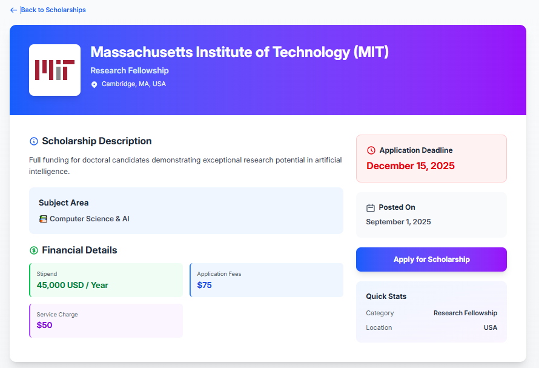

# 🎓 Scholarship Management System - Frontend

[](https://schoolarship-management-system-fron.vercel.app/)
[](https://schoolarship-management-system-serv.vercel.app/)

## 🌐 Live Links

* **Live Site:** [https://schoolarship-management-system-fron.vercel.app/](https://schoolarship-management-system-fron.vercel.app/)
* **Server:** [https://schoolarship-management-system-serv.vercel.app/](https://schoolarship-management-system-serv.vercel.app/)

---


## Project glimpse


### Home Page


### Scholarship Details Page



## 📖 Project Overview

The **Scholarship Management System** is a comprehensive platform connecting students with university scholarships. Users, moderators, and admins have role-based access to manage scholarships, applications, and reviews efficiently.

---

## ✨ Key Features

### 🔐 User Features

* Multi-role Authentication (User/Moderator/Admin) via Firebase
* Profile management & role-based dashboards
* Scholarship search, filter, and sort
* Application tracking with status updates
* Secure card payment integration via Stripe
* Review system for scholarships
* Fully responsive design

### 👨‍💼 Admin Dashboard

* User management & role assignment
* Scholarship CRUD operations
* Application monitoring and status updates
* Review moderation
* Statistical dashboard
* Moderator request approval

### 📝 Moderator Dashboard

* Scholarship management
* Application review & feedback
* Review moderation
* Scholarship statistics

### 💳 Application & Payment System

* Secure card payment form with validation
* Application fee processing
* Payment history tracking
* Application status notifications
* Edit/cancel applications before processing

---

## 🛠️ Tech Stack

### Frontend

* React.js
* React Router DOM
* Tailwind CSS + DaisyUI
* Firebase Authentication
* SweetAlert2 & React Toastify
* Vite

### Backend

* Node.js + Express.js
* MongoDB
* Stripe Integration
* CORS
* dotenv

### Deployment

* **Frontend:** Vercel
* **Backend:** Vercel
* **Database:** MongoDB Atlas

---

## 🌱 Environment Variables

Create `.env.local` in the root of the project:

```env
# API URL
VITE_API_URL=https://schoolarship-management-system-serv.vercel.app

# Firebase Config
VITE_FIREBASE_API_KEY=your_api_key
VITE_FIREBASE_AUTH_DOMAIN=your_project.firebaseapp.com
VITE_FIREBASE_PROJECT_ID=your_project_id
VITE_FIREBASE_STORAGE_BUCKET=your_project.appspot.com
VITE_FIREBASE_MESSAGING_SENDER_ID=your_sender_id
VITE_FIREBASE_APP_ID=your_app_id
VITE_FIREBASE_MEASUREMENT_ID=your_measurement_id

# Stripe Publishable Key
VITE_STRIPE_PUBLISHABLE_KEY=pk_test_XXXXXXXXXXXXXXXXXXXX
```

> 🔹 **Important:** Only use the **publishable key** for Stripe in frontend. Never expose your secret key.

---

## 🚀 Getting Started

1. Clone the repository:

```bash
git clone https://github.com/Jami40/Schoolarship_System_Mangement_Client.git
cd Schoolarship_System_Mangement_Client
```

2. Install dependencies:

```bash
npm install
```

3. Create `.env.local` and add your Firebase and Stripe keys.

4. Run the development server:

```bash
npm run dev
```

5. Open [http://localhost:5173](http://localhost:5173) in your browser.

---

## 📦 API Endpoints

### Users & Authentication

```
POST   /users                          
GET    /users/:email                   
PATCH  /users/request-moderator/:email 
PATCH  /users/approve-moderator/:email 
DELETE /users/:email
```

### Scholarships

```
GET    /scholarships
GET    /scholarships/:id
POST   /scholarships
PATCH  /scholarships/:id
DELETE /scholarships/:id
```

### Applications

```
POST   /applications
GET    /applications/user/:email
PATCH  /applications/:id
DELETE /applications/:id
```

### Reviews

```
POST   /reviews
GET    /reviews/user/:email
GET    /reviews/scholarship/:id
PATCH  /reviews/:id
DELETE /reviews/:id
```

### Payments

```
POST   /create-payment-intent
```

---


